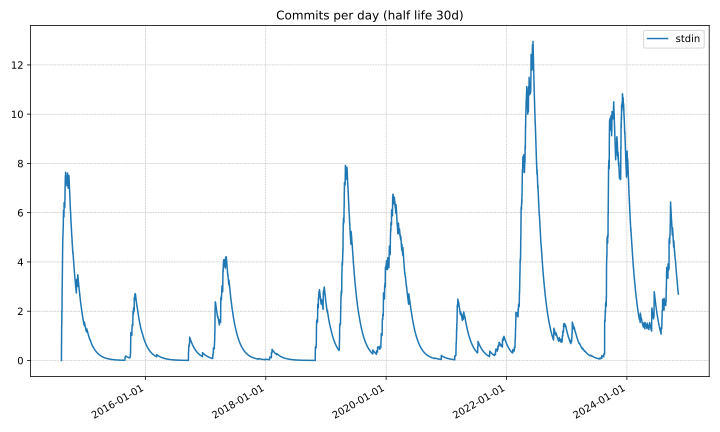

# Edge: Lessons: Introduction

This document is work-in-progress.
As of 2024-04-13, this is still incomplete
and probably contains errors.
I haven't yet had the time to fully review it.

This document is **an attempt to capture lessons I've learned
after a decade of working on Edge** (my personal text editor).

Many of the lessons described are fairly technical
but at least one (Bursts & Pauses) is general
—observations about the life-cycle of side-projects.
Among the technical lessons,
many are specific to C++,
but they probably apply, to some extent,
to other languages.

## Background

Edge is a Linux C++ terminal-based text editor.
I started working on
Edge in 2014
–making the
[very first commit](https://github.com/alefore/edge/commit/312ecc2462315e8e0648cbd2680cc0366819df1e)
on 2014-08-09.
I've used Edge ~exclusively since 2015.

Edge has its own extension language,
which looks like C++ with memory management,
and has logic (such as syntax highlighting)
for editing C++, Markdown, Java, Python
and a few other file types.

I mainly use it…

* for programming at work
  (though this days I program relatively little at work),

* to maintain my
  [Zettelkasten](https://github.com/alefore/weblog/blob/master/zettelkasten.md),

* as my planning & productivity management system
  (which is integrated with my Zettelkasten,
  so this is really repeating the previous point), and…

* to develop Edge.

### Statistics

As of 2024-04-14, Edge is 67.9k lines of C++ code
(per `wc -l $(find src -name '*.cc' -or -name '*.h' -or -name '*.y'`).

The following is a plot of commits per day:

## Caveats

* I believe there's significant **recency bias** in this distillation.
  I'm probably overweighing insights I've reached relatively recently
  –towards Edge's tenth anniversary–
  and not doing justice
  to those from the beginning of the journey.

* The lessons described here are fairly **subjective**.
  These are *not* universally applicable principles.
  They rest on various assumptions specific to my context,
  which may not apply to other environments or systems.
  I'm holding back from prefixing nearly every sentence
  with "in my experience" or similar qualifiers,
  but they should be assumed.

