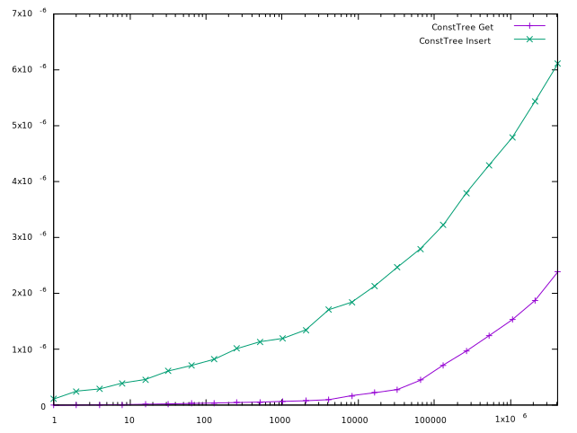
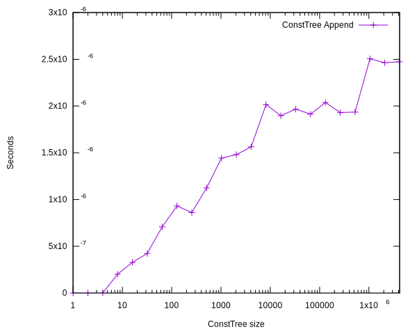

# Immutable AVL Trees

Immutable AVL trees are an undervalued container data structure for holding
lookup tables.

## What are Immutable AVL Trees

Immutable AVL Trees are a balanced binary tree structure where each
non-empty tree holds:

* An immutable "head" value.
* Two immutable AVL "left" and "right" subtrees. Since this is an AVL tree,
  the depth of these subtrees must differ by at most 1.
* As an optimization, to permit quick implementation of insertion operations as
  well as position-based indexing, the head also stores the depth of
  the tree explicitly.

I call each non-empty tree a "tree node".

### Index-based Access

An Immutable AVL Tree can enable index-based access, with operations
such as:

* Return the value at index i (where 0 ≤ i < n, where n is the number of
  elements in the tree).
* Insert a value at index i, displacing elements in subsequent positions.

To support this, nodes should store explicitly a counter of the number of values
they contain (the sum of values in its subtrees, plus 1). This allows them to
quickly know to which of its subtrees they should dispatch a position-based
operation that they can't handle directly (i.e., that doesn't refer to their
head).

### Key-based Access

If an Immutable AVL Tree wants to support key → value lookups based on an
arbitrary key type, each node can store the ID corresponding to its head.
Alternatively, the tree could let the keys be stored implicity in the values,
using a deterministic accessor function to retrieve them dynamically.

Key-based access can be offered instead of or in addition to Index-based
Access. If no keys are provided, only index-based access will
be supported.

#### Keys: Full Order

To support key-based indexing, a full order must be defined on the
keys' type. The tree will hold the elements in the order given by the keys, in
order to be able to quickly establish which subtree holds a given key (whether
it's smaller or greater than the node's key).

#### Keys: Uniqueness

The insert operation of an Immutable AVL Tree that supports Key-based
Indexing will typically ensure uniqueness of the keys: that a key will
be associated to at most one value in the tree.

However, an Immutable AVL Tree could relax this requirement and support
multivalue lookups.

##### Support multivalue lookups

To support multivalue (i.e., key → {value}) lookups, an Immutable AVL Tree needs
only to use as its value type an immutable container of the customer's value
type.

In this case, special care should be taken to define clean semantics for trees
that also wants to support index-based access.

### Examples

The following are a few example implementations:

#### Edge

A fairly succinct example implementation of an Immutable AVL Tree is the
`ConstTree` class distributed as part of the Edge text editor:

* https://github.com/alefore/edge/blob/master/src/const_tree.h

Edge uses this implementation both to store the list of lines in a file, as well
as the list of characters in a modified line (as an optimization to reduce
memory, unmodified lines are stored contiguously as a char array).

#### Micha

An implementation of Immutable AVL Trees for Java can be found in
Micha Riser's [Java Collection
Library](https://github.com/iquadrat/collection/blob/master/README.md) in the
[PersistentTreeMap
class](https://github.com/iquadrat/collection/blob/master/org.povworld.collection/src/org/povworld/collection/persistent/PersistentTreeMap.java)

### Immutable Operations

The "immutable" characteristic of the tree means that a tree is fundamentally
immutable. This requires, naturally, that the values contained are also deeply
immutable.

That means that operations such as insertion or deletion just return a copy of a
tree with the modification applied to it.

#### Example Immutable Operations in Edge

The following is an example in Edge to insert an element `line` at the position
`line_position.line` into the tree `lines` (`Lines` here is just an alias for
the tree type):

    auto prefix = Lines::Prefix(lines_, line_position.line);
    auto suffix = Lines::Suffix(lines_, line_position.line);
    lines_ = Lines::Append(Lines::PushBack(prefix, std::move(line)), suffix);

The point here is that the original tree pointed to by `lines_` is never
directly mutated; instead, we create two new trees and append them, with the new
element in the middle. `Lines::PushBack` doesn't mutate the tree pointed to by
`prefix` but return a new tree that references it internally.

### C++: Shared Pointers

In C++, `std::shared_ptr<const TreeNode>` (where `TreeNode` is the structure
containing the fields of a non-empty tree) is a great fit for a node in an
Immutable AVL Tree to hold pointers to the subtrees.

This allows new trees to share most of the memory of their parent trees,
allowing older nodes to be reclaimed automatically as they are abandoned.

#### Shared Pointers: No cycles

The immutability of the structure and values in Immutable AVL Trees
makes cycles impossible: a node can only refer to elements that existed before
its construction. This alleviating the main problem of shared pointers:
memory leaks due to unreachable cycles.

### Values: Requirements

Tree operations will need to create new trees that share structure (at least
partially). Because of this, implementors have two choices:

* If a given value doesn't require too much memory and can be quickly copied,
  implementors may allow the tree to copy them around when needed (i.e., when
  a new tree node needs to be created holding them).

* Otherwise, the tree can store the values in the nodes as shared pointers
  (`std::shared_ptr<const T>` in C++). Values in a derived tree (where some
  nodes are different than in an original tree) will be pointers to the same
  values from the original tree.

## Advantages

Immutable AVL Trees are good because they are:

* efficient,
* flexible,
* simple, and
* immutable.

### Efficient

Immutable AVL Trees are fast: they can perform the following operations in
logn runtime complexity (all receiving either a key or an index):

* Return a value
* Insert a value
* Delete a value
* Append two trees (where keys in one tree are smaller than keys in the other).

#### AVL Trees: Depth Complexity is Logarithmic

The depth of an AVL tree grows logarithmically to the number of elements it
contains.

To see this, let Nᵢ be minimal number of nodes that are
required to form a tree of depth i.

If a tree has depth i, at least one of its subtrees must have depth i - 1.
Because this is the mimimal number of nodes, the other subtree must have the
smallest possible depth allowed by the AVL constraint, i - 2. This gives:

    Nᵢ = Nᵢ₋₁ + Nᵢ₋₂ + 1

Applying the same formula recursively (to i - 1), we have:

    Nᵢ₋₁ = Nᵢ₋₂ + Nᵢ₋₃ + 1

Replacing Nᵢ₋₁ in the first formula, we get:

    Nᵢ = (Nᵢ₋₂ + Nᵢ₋₃ + 1) + Nᵢ₋₂ + 1
       = 2Nᵢ₋₂ + Nᵢ₋₃ + 2

This implies:

    Nᵢ > 2Nᵢ₋₂

In other words, going up two levels (from depth i - 2 to i) means we'll need
at least twice as many nodes.

Applying this recursively yields:

    N₂ᵢ > 2ⁱ

This implies that the number of nodes required to reach a given depth grows
exponentially; in other words, given N nodes, the maximum depth that you can
reach will grow proportionally to log₂N.

#### AVL Trees: Rotations

We call a binary search tree an "almost AVL" tree if its subtrees are AVL
trees and their depth differs by at most 2.

The rotation operations are at the heart of the AVL trees. They take an almost
AVL tree and, in constant time, produce an equivalent AVL tree.

If the input tree was already an AVL tree, no rotation is needed: the tree is
returned as is. Otherwise, if the difference in the subtrees' depth was actually
2, the rotations will produce a tree with depth equal to the depth of the input
minus 1.

#### AVL Trees: Insertion is Logarithmic

To insert a new element into an AVL tree, we simply go down the tree selecting
the branch that leaves us closest to the insertion point until we arrive to an
empty tree and replace that empty tree with a new leaf tree containing the new
element.

For example, suppose we have the following AVL tree (A is an unexpanded
subtree):

        p
       / \
      A   s
         / \
        r   t
       /
      q

If we wanted to insert an element immediately after `p`, we would use the new
leaf as `q`'s left child. If we wanted to insert it after `q`, it would be its
right child.

The new tree won't necessarily be an AVL tree, but working our way upwards,
starting at the insertion point and applying rotations as necessary, we can turn
it into an AVL tree by applying at most a logarithmic number of constant-time
rotations.

#### AVL Trees: Deletion is Logarithmic

It is also easy to see that deletion is logarithmic.

Start by recursing down the tree until you find the node `N` corresponding to
the element you want to delete. We will replace `N` with a new tree `N'` where
the difference in their depth will be at most 1, so `N`'s parent will be an
almost AVL tree. We can then apply a rotation, to turn the almost AVL tree into
an equivalent AVL tree; its parent will now be an almost AVL tree, and so we
recurse upwards. The two operations are just traversing the tree downwards and
upwards, applying constant-time operations at each step, so they have
logarithmic runtime.

To produce `N'` we simply "borrow" the head from one of the subtrees and recurse
downwards into that subtree to delete its head. If at least one subtree is
empty, we can simply use the other subtree.

#### AVL Trees: Append is Logarithmic

Two AVL trees can be appended in logarithmic time, as long as all the keys in
one tree are larger than the keys in the other. For index-based AVL trees this
is true by definition of the "append" operation (elements in the second tree
come immediately after those in the first).

To append two non-empty trees, let `x` be the last element in the first of the
trees and `A` an AVL tree equivalent to the first tree with `x` removed. We can
compute `x` and generate `A` in logarithmic runtime. Our new task is to append
two trees `A` and `B` with `x` in-between, as in:

      x
     / \
    A   B

Obviously, we can't just return such a tree, since `A` and `B` may have vastly
different depths. Instead, we construct an equivalent tree that meets the AVL
invariant.

For simplicity, let's assume that `A` is the deepest of the two trees (the other
case is symmetric). We're going to insert the elements in `B` inside of `A`
(producing a new AVL tree that contains the desired output), and we're going to
do this in logarithmic time.

We descend in `A` always following the right subtree (the elements that will be
adjacent to `B`) until we find a right subtree that is equal in depth to `B`.
Suppose that `A` is equal to the following tree (where `C`, `E`, `F`, `G`, and
`H` are subtrees that I didn't fully expand) and that `H` has the same depth as
`B`:

      o
     / \
    C   p
       / \
      E   q
         / \
        F   r
           / \
          G   H

We now replace `H` with a new AVL tree with head `x`:

      o
     / \
    C   p
       / \
      E   q
         / \
        F   r
           / \
          G   x
             / \
            H   B

At this point, the tree at `x` is an AVL tree (by construction: `H` and `B` have the same depth) but the ancestors (the trees at `r`, `q`, `p`, and `o`)
may not be: the depths of `r`'s subtrees, `G` and the tree at
`x`, may be 2 (this happens when `depth(G) + 1` equals `depth(H)`).

However, in this case, we simply do a rotation (to turn the tree with head `r`
into an AVL tree), and follow the ancestors upwards, applying rotations (if
necessary) until we reach the head. In the worst case, we'll have effectively
applied a logarithmic number of constant-time rotations.

#### logn Complexity is Fine

For most algorithms that we encounter in practice, logn runtime
complexity tends to be perfectly acceptable.

##### Why logn Algorithmic Complexity is Fine

For most values of n that we're likely to encounter in practice, algorithms of
logn complexity will require so few operations that practical considerations
will matter significantly more. That means they're largely undistinguishable
from constant runtime complexity.

For example, consider a logn operation on a container holding 10 million items,
more than most containers we find in practice. Such an operation will require
only 24 operations! If we constrain ourselves to 50 operations, we'll already
able to handle over 1125 trillion items.

#### Const Tree: Performance

##### Get, Insert, Delete

The following graph depicts the performance of Get, Insert, and Delete
operations in my ConstTree implementation as the container grows:

##### Append Trees Graph

The following is the time in seconds of creating a tree of a given size by
appending two trees (of random sizes that add up to the final size), showing
how it scales as the size of the resulting tree grows:

### Flexible

Immutable AVL Trees are very flexible. Since they're fast, they can
directly replace all of the following structures in many situations:

* Hash tables, as long as a full order can be defined on the keys. We trade the
  amortized constant-time lookup for logarithmic lookup, but we avoid the
  worst-case linear time due to collisions (and, conversely, the need to
  resize the table).

* Multi-value hash tables, by using an immutable container as the internal
  value.

* Vectors, based on index-based access. AVL trees have significantly
  faster insertion (logarithmic vs linear) and acceptable lookup. Vectors are a
  better choice in situations that only require insertion or deletion at the
  end, where their constant-time lookup will beat AVL tree's logarithmic lookup.

* Lists, based on index-based access, with significantly faster
  lookup. One advantage of lists, though, is when index-based access is used and
  iterators that follow a value  across insertions and deletions are useful. In
  this case, for lists, we simply take a pointer to the node; this becomes
  trickier with Immutable AVL Trees, where the index of existing elements shifts
  as insertions or deletions execute.

### Simple

Immutable AVL Trees are very easy to implement. There's a slight bit of
complexity required around the rotations, but it's not too bad.

I'll offer, again, the example from Edge's [ConstTree
class](https://github.com/alefore/edge/blob/master/src/const_tree.h). It uses
only 184 lines of code, a big part of which is just to implement "optional"
operations such as `Every`, `Prefix`, `Suffix`, and `UpperBound`. I invite you
to read it and see for yourself how simple this really is.

### Immutable

The immutable aspect is a big advantage of Immutable AVL Trees because
of two reasons:

* Retaining Snapshots
* Immutable state

#### Snapshotting

It is possible to trivially retain snapshots of an Immutable AVL tree, in
constant time: one simply needs to retain a pointer to the tree.

##### Share Memory

As the program moves along, applying modifications and retaining the result of
those modifications, the two (or more) trees will share as much of their
internal structure as feasible (while still maintaining their balance, so that
operations on them remain fast).

##### Comparison

It is possible to implement snapshotting for other types of container
structures, but it's likely going to be significantly less efficient and/or more
complex than it is in Immutable AVL Trees.

##### Example in Edge

As an example to illustrate the value of Snapshotting in Immutable
AVL Trees, in Edge I use this to feed work to background threads,
without having to synchronize state (since the threads don't share any mutable
state). This allows the user to continue modifying the buffer while these
operations run asynchronously, on a snapshot. I use this to:

* Asynchronously update the syntax tree (for syntax highlighting) while the
  user may continue to modify the buffer.

* Asynchronously save the buffer to disk.

When background threads are done computing something, they simply schedule a
callback to consume the results, to be executed in the main thread.

#### Readable Code

Immutable AVL Trees support the efficient construction of new trees
derived of original trees. This allows customer functions that operate on them
to receive a tree as an input and return a (possibly new) tree as their output.
With other mutable data structures, those functions would instead have to
operate in a structure in-place.

This is good because it supports and encourages referential
transparency for functions that operate on these types.

