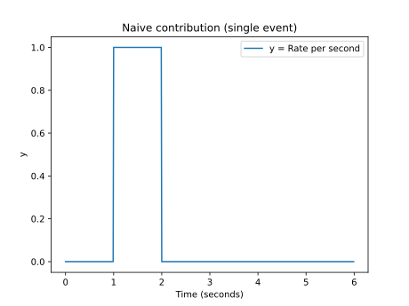
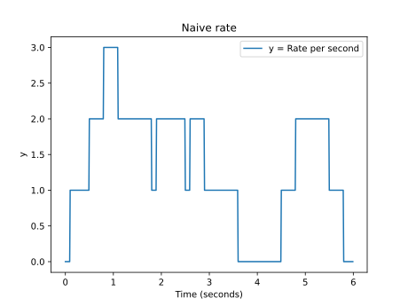
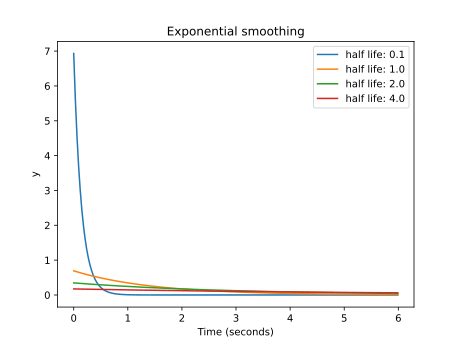
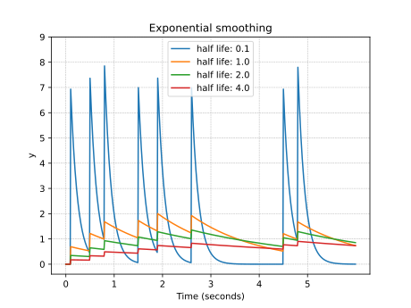
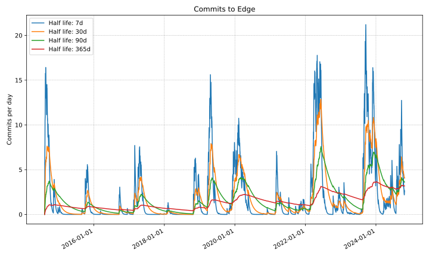

# Exponential smoothing

Exponential Smoothing is a technique to keep track of the average value of a
signal, weighted towards the most recent values.

A "half life" parameter controls how biased the computation
is towards recent values.

## The problem

Discrete events occur at specific timestamps.
A smoothing algoritm receives these timestamps
and computes a timeseries
modeling a "rate" at which events are occurring
(*e.g.*, requests per second, commits per week).

The output should be somewhat "smooth":
a parameter controls how quickly the output signal
reacts to changes in the event occurrence.

The input may itself be a timeseries
with a rate of events.
It could even be the output of a previous execution of exponential smoothing.
The smoothing algorithm produces a new "smoother" view.

### Examples

The following are common examples:

* Given timestamps of requests,
  compute a timeseries with the rate of requests per second.

* Given timestamps of commits to a version control repository,
  compute a timeseries with the rate of action
  (e.g., commits per week).

* Given a metric corresponding to the number of active requests
  executing in a server sampled every 10 milliseconds,
  compute a smoothed view with longer-running
  lower-resolution averages.

## Smoothing algorithms

A smoothing algorithm which computes the signal value at a time `t`
can be modeled by taking the set of all events `e`
that have occured at a previous time `e.time() <= t`
and adding the "decayed contribution" of these events
(relative to time `t`):

    o(t) := sum(e.contribution(t) for e in EVENTS if e.time() <= t)

An efficient implementation wouldn't need to keep track of all events.
Typically, we receive a possibly-very-long stream of time-sorted events
and produce an output incrementally.

## Running windows

If an event occurs at a time `t`,
we could model its contribution as
adding a value of 1 to the output
for all times between `t` and `t + 1 second` (and 0 otherwise):

This is *not* exponential smoothing.
Instead, we call this smoothing algorithm "running window".
That's because an equivalent formulation is to say that at any time,
we simply count how many events occurred in the last second.

For example, if events ocur at times
0.1, 0.5, 0.8, 1.5, 1.9, 2.6, 4.5 and 4.8,
this would model the output rate as:

## Exponential decay

Exponential smoothing uses a specific formula
that makes the contribution of an event to the output
decay exponentially as time passes.

This is done based on a "half-life" parameter that controls
how quickly the output reacts to changes in the rate.

Let `h` be the half-life and `d` the amount of time elapsed after an event.
The contribution of the event, `decay(d)`, can be computed thus:

    scale_constant = ln(2) / h

    decay(d) := pow(2, -d / h) * scale_constant

### Why the scale constant?

The reason for the `scale_constant` factor (of `ln(2) / h`) is
to scale the function,
so that its integral (from d=0 to d = ∞) is exactly 1:

    ∫₀᪲  decay(t) dt = 1

If we didn't multiply by ln(2), we would be overestimating the rate:
we would be allowing each event to have a contribution
of 1/ln(2) (~1.4427) to the output.

### Simple examples

The following is the contribution of a single event with different half-lifes:

With the events at
0.1, 0.5, 0.8, 1.5, 1.9, 2.6, 4.5 and 4.8,
the rate (in events *per second*) would be modeled thus
based on different half-life values:

### Real examples

One can produce a set of timestamps of commits to a git repository thus:

    git log --format="%ct" | sort

Why do we need to sort it?
Merges/rebases make git history not always follow chronologic order.

We can use this to produce a view of commit rates
(this example corresponds to [Edge](http://github.com/alefore/edge)):

Given a repository, `exponential-smooth` and `tstosvg`
can generate a view thus:

    git log --format="%ct" |\
    sort |\
    exponential-smooth --half_life=30d --output_rate=1d --output_resolution=6h | \
    tstosvg >/tmp/output.svg

### Quality disadvantages of running windows

The rates modeled by Exponential decay tend to be better
than those from running windows because they incorporate more
information about the events.

Running windows are "binary" in assigning weights to events:

* All events that happened inside the window have the same weight (1),
  regardless of how recent they are

* All events outside the window have the same weight (0).

This means that running windows tend to show strange artifacts
when there are bursts.

TODO: Graph the above.

### Efficient computation

The sum of the decays of many events equals
the decay of the sum of many events.
In other words, if we know the contribution of all events
at a previous time t0, we can compute the contribution at time t
simply by decaying the sum.

That allows us to implement exponential decay very efficiently,
simply remembering two values:

* timestamp: The timestamp of the last update.
  This can start at a value infinitely in the past
  (or, depending on coding preferences, an explicit "absent" value).

* rate: The output rate at the last update.
  This can start at 0
  (when no events have ocurred, the rate is modeled at 0).

As we iterate the stream of events, we update the values cheaply:

* timestamp: The timestamp can be updated to the new event time.

* rate: The output rate is computed by decaying its previous value
  depending on the duration between the two timestamps
  (the last and the new timestamp values).

The decay factor can be computed relatively quickly as:

    pow(2, -elapsed_duration / half_life_duration) * scale_constant

#### Python implementation

The following is my implementation of a simple Python script
that receives a file with timestamps and event counts
and produces a timeseries applying exponential smoothing.

One can use it to produce a view of commits on a git repository thus:

    git log --format="%ct 1" | sort -n | \
    exponential-smooth --half_life=30d --output_rate=1d --output_resolution=1d

This produces a timeseries (which `tstosvg` can render).

File `~/bin/exponential-smooth` (mode 755):

    #!/usr/bin/python3
    import math
    import argparse
    import re
    import sys
    from datetime import datetime, timedelta, timezone
    from typing import Generator, List, Optional, TextIO, Tuple

    # Input is lines of the form: "1407621609 23".
    # The first token is a timestamp (seconds since beginning of Unix epoch).
    # The second otken is a number of events occurring at that timestamp.
    def Parse(input_file: TextIO) -> Generator[Tuple[datetime, float], None, None]:
      for line in input_file:
        parts = line.strip().split()
        if 1 <= len(parts) <= 2:
          timestamp = datetime.fromtimestamp(float(parts[0]), tz=timezone.utc)
          value = float(parts[1]) if len(parts) > 1 else 1
          yield timestamp, value
        else:
          raise ValueError(
              "Input should contain exactly two tokens: a timestamp and a value.")

    def ParseDuration(duration_str: str) -> timedelta:
      TIME_UNITS = {
          's': 'seconds',
          'm': 'minutes',
          'h': 'hours',
          'd': 'days',
          'ms': 'milliseconds',
          'us': 'microseconds'
      }
      TIME_UNITS_REGEX = re.compile(rf"^(\d+) *({'|'.join(TIME_UNITS.keys())})$")
      match = TIME_UNITS_REGEX.match(duration_str)
      if match:
        value, suffix = match.groups()
        unit = TIME_UNITS[suffix]
        return timedelta(**{unit: int(value)})
      raise ValueError("Invalid duration format. Supported units are: " +
                       ", ".join(TIME_UNITS))

    class Smoother:

      def __init__(self, half_life: timedelta, output_rate: timedelta,
                   output_resolution: timedelta) -> None:
        self.half_life: timedelta = half_life
        self.output_resolution: timedelta = output_resolution
        self.next_output: Optional[datetime] = None
        self.current_timestamp: Optional[datetime] = None
        self.current_rate: float = 0
        self.decay_scale_constant = math.log(2) / (self.half_life / output_rate)

      def Process(self, values: Generator[Tuple[datetime, float], None,
                                          None]) -> None:
        for time, value in values:
          if self.next_output:
            while self.next_output < time:
              self.Output()
          else:
            self.next_output = time
            self.Output()
          self.DecayToTime(time)
          self.current_rate += value * self.decay_scale_constant

      def Output(self) -> None:
        assert self.next_output is not None
        self.DecayToTime(self.next_output)
        print('%s %s' % (self.next_output.timestamp(), self.current_rate))
        self.next_output += self.output_resolution

      def DecayToTime(self, time: datetime) -> None:
        if self.current_timestamp is None:
          self.current_timestamp = time
        assert time >= self.current_timestamp
        elapsed = (time - self.current_timestamp) / self.half_life
        self.current_timestamp = time
        self.current_rate *= pow(2, -elapsed)

    def main() -> None:
      parser = argparse.ArgumentParser(
          description='Apply exponential smoothing to a series of timestamps. '
          'The output is the per-second rate.')
      parser.add_argument(
          "--half_life",
          type=ParseDuration,
          default="1s",
          help="Duration for a half-life of decay")
      parser.add_argument(
          "--output_rate",
          type=ParseDuration,
          default="1s",
          help="Rate to compute (e.g., events per second)")
      parser.add_argument(
          "--output_resolution",
          type=ParseDuration,
          default="1s",
          help="Frequency of lines in the output")
      args = parser.parse_args()
      Smoother(args.half_life, args.output_rate,
               args.output_resolution).Process(Parse(sys.stdin))

    if __name__ == "__main__":
      main()

## Biases

How exponential smoothing is used can introduce biases in the data.
This is not specific to exponential smoothing but potentially affects
all smoothing algorithms.

A smoothing implementation may assume
that events always occur at exactly the timestamp when they are registered.
If the rate is computed at exactly those timestamps,
this may overestimate the rate.
Conversely, if the rate is computed exactly *before* the events are registered,
the rate will be underestimated.

One way to protect against this could be
to assume that the event occurred at exactly the half-way point
between the last registration and the current registration.

### Why this may happen

For example, a server using a `rate_tracker` instance
(of a class implementing exponential smoothing)
to keep track of request rates could do something like this:

    Time now = clock.Now();
    rate_tracker.Advance(now);
    // Underestimates the actual rate!
    Rate current_rate = rate_tracker.GetCurrentRate();
    request_rate.RegisterEvent();

This would underestimate the rate
(always reading it before registering a new event).
Conversely, registering the event *before* reading the rate
biases the data in the opposite direction:

    rate_tracker.Advance(now);
    request_rate.RegisterEvent();
    // Overestimates the actual rate!
    Rate current_rate = rate_tracker.GetCurrentRate();

