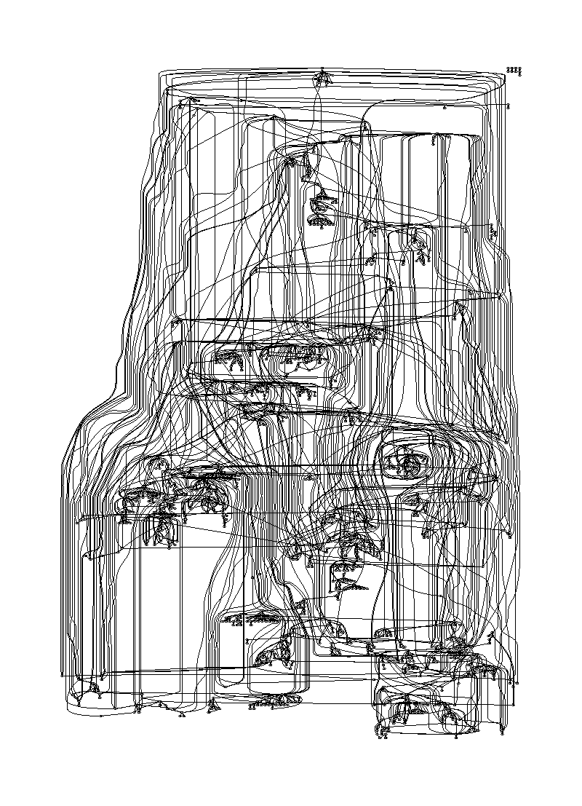
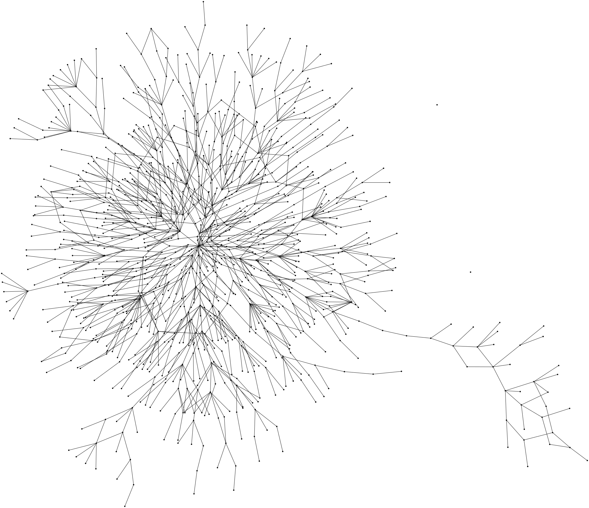
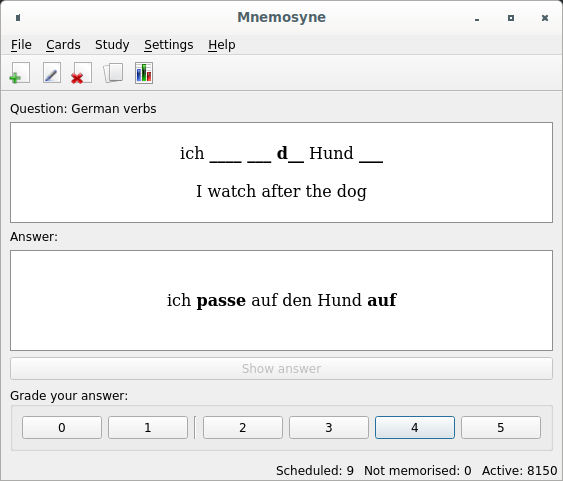

# Zettelkasten

I'm using several Zettelkasten principles as a way to organize and develop my
thinking.

## What are Zettelkästen?

A Zettelkasten (German for "notes box" or "notes cabinet") is a method to take
and organize notes about multiple topics. This method has been used by many
writers for centuries and is being "rediscovered" recently by many bloggers and
rationalists (myself included).

### Plurals

In German, the word Zettel is both the singular and plural form for "a note"
("notes"). Kasten means "box" or "cabinet", so the compound noun Zettelkasten
means "box of notes". The plural, "boxes of notes", would be Zettelkästen.

### Notorious Users

Many articles online associate the Zettelkasten system with the German
sociologist Niklas Luhmann, who left behind a very large (90.000) collection of
notes and who described a few techniques for organizing paper Zettel ("notes").

However, many other notorious writers have used Zettelkästen. For example, an
[article in Der Spiegel from
1966](https://www.spiegel.de/spiegel/print/d-46407320.html) mentions how Jules
Verne, who died two decades before Luhmman's birth, used a Zettelkasten
consisting of 25.000 notes.

## Digital Zettelkasten

I decided to create my Zettelkasten as a set of digital files, rather than
following the time-tested approach of writing physical notes. This mostly
reflects the fact that I'm very comfortable viewing and editing text files and
prefer the mobility, durability and efficiency (of searching, navigating, etc.)
aspects of the digital medium.

I'm somewhat curious as to what advantages a physical Zettelkasten would have
that I'm missing out on. I suppose I'll never know.

### Git

I store my Zettelkasten in a git source code repository.

I considered using a private repository in GitHub but, for the time being, I'm
using Google Cloud Source Repositories to back up my repository. This has worked
well so far. I even get a repository viewer that renders Markdown files well
enough, though I use it very rarely; I'm much more likely to peruse my notes
through my text editor, since that allows me to modify them directly.

### Searching

To search inside my Zettelkasten I mainly use plain text search.
I don't keep any reverse index or such,
basically just `grep` (or `awk`) directly.

As of 2024-04-14, the search glob `???.md` matches 3.8k files;
these Markdown files contain
1.8e6 bytes in 66.5e3 lines.
The search is so fast that I can display results as I type the search query.

This is implemented in functions `Search` and `TitleSearch` in Edge's
[rc/editor_commands/lib/zk.cc](https://github.com/alefore/edge/blob/master/rc/editor_commands/lib/zk.cc).
As you can see, just plain calls to `grep` and `awk`.

## Directory Structure

My Zettelkasten consists of two directories:

* `/`: A set of Markdown files, one for each note.

* `images/`: A set of image files, mostly in JPEG and SVG format.

### Flat namespace

I decided to use a flat namespace that contains all my notes, rather than a
hierarchical namespace (e.g., folders and sub-folders).

Some Zettelkasten users structure their notes hierarchically, such as Luhmann's
"4c1f12" system (i.e., alternating numbers and characters for deeply nested
hierarchies of notes, where "4c1f12" is just short form for "4.3.1.6.12") and
supplement that hierarchical structure with additional links across notes.

However, I prefer to schew the restriction of having to lay my notes in such a
hierarchy and, instead, just collect them in a flat namespace. This works for me
because it forces a structure to evolve organically. Using links would still
enable the set of notes to be organized as a directed graph rather than a tree,
but it would still impose an underlying tree-like structure or view, forcing
each note to take a unique place in the hierarchy, which feels unnatural.

### Note names

The names of the note files are simply three-character IDs starting from `000`
and including numbers as well as lowercase characters (e.g., `0b9.md` is my note
about the city of Macau). This seems to work well for me.

With this schema I can create a total of (10 + 26)³ = 45e3 notes, which I think
suffices. If I ever reach that limit, that will mean I've been very successful
with my Zettelkasten; I can, at that point, adopt uppercase characters, which
would increase the namespace to 238e3 notes. As of 2023-09-02 I'm still far from
that, though: the last note I've created is `2hp.md` (the 3227th note).

I have a symbolic link `index.md` which points to my main entry point note (note
`0a9.md`). This is used by my `:zki` (Zettelkasten Index) command to take me to
the "index" into my notes.

#### Why Not Readable Names

I considered using "human readable" names instead of my "unique ID" approach for
the file names (paths) in my Zettelkasten. Perhaps I could have taken
just the titles of notes.

I'm not sure this would have been better; it might have saved me from
implementing some automation in Edge (e.g., I would be able to load a file just
by remembering its title, without having to ... do the same through the
automation in Edge).

In the beginning, I created various symbolic links like `bitcoin.md` for a few
topics. However, I ended up getting rid of them; instead, I just always go
through the index (with `:zki`) or search directly for articles that have a
token in their title (e.g., `:zkt bitc`), which turned out to be more
comfortable for me.

#### Why Not Dates

I considered using date-based schemas for the paths, such as `2020-04-10-0.md`
or just `2004100.md`. Proponents of this approach emphasize the advantage of
knowing when a note was created.

I decided to opt for the simpler 3-characters approach because I thought it
would keep the friction (of refering to notes) slightly lower.

Furthermore, I felt that metainformation about a note's creation and access is
important enough to deserve additional mechanisms and, once these
mechanisms are in place, embedding this in the note's title is somewhat
superfluous.

##### Notes: Metadata

I keep metadata about my notes in the following ways:

* Embedded directly in the notes contents. The obvious example of this are the
  links that occur in a note's text.

* In the history in my git repository. This lets me see not only when the note
  was created, but its entire history, down to the granularity with which I
  commit to the repository (which isn't every single time I add or edit a note,
  but around once per day).

* In my text editor's log. This is (as of 2020-04-10) work in progress. I keep a
  log for each file of every time I've opened it and every single transformation
  I've done on it. Obviously, this grows quickly, so I expect I'll have to start
  trimming down the logs soon. And I haven't yet generated many visualizations
  for this data. However, I expect that, in the future, I will be querying these
  logs for information such as total time I've spent looking at a given note,
  frequency of access to notes by different criteria (e.g., day of the week,
  time of the day), etc..

### Image files

I decided to collect images in my Zettelkasten. That allows me to augment my
notes with pictures of paintings or graphs of functions. Whenever I add an
image, I create a note about it (I have a few exceptions to this rule, but
that's all they are: exceptions).

## Note Structure

Every Zettel in my Zettelkasten is a Markdown file with the following
structure:

* Name of the idea given as the title of the document.

* Text describing the idea.

* Set of related links, in a "Related" section.

* Set of tags (optional). I haven't yet derived any actual value from the tags.
  Perhaps this means that I have fairly good structure Zettel; perhaps that my
  search functionality works very well; perhaps that my Kasten hasn't grown
  enough to the point where this will become useful.

* Metadata

### Links

Each note in my Zettelkasten contains links to other related
notes.

Links can occur directly in the text or in a separate "Related" section given
after the text.

The "Related" section contains just a list of bullets with one item per link.
Sometimes I annotate links by prefixing them with one of the following words:

* Why - The link points to a related note that explains the reasons behind the
  idea.

* How - The link points to a related note that augments the current idea by
  providing guidance on how to apply it.

* Counterpoint - The related note can be seen in conflict.

#### Counterpoints

Notes in my Zettelkasten link to ideas that they can be considered to
be in conflict with.

To do this, I annotate such links as "Counterpoint:".

##### Models Grow From Conflicting Thoughts

You may have ideas or thoughts that conflict with a model that you're exploring;
by exploring the conflicts you gain deeper understanding of the context, which
often enables you to strengthen (rather than discard) the model.

The goal of analyzing contradictions in our thinking shouldn't necessarily be to
resolve them (by adjusting or removing one of the ideas in conflict) but rather
to enrich our understanding.

#### Structure

I think representing the set of notes in my Zettelkasten as a full graph is more
adequate than imposing a tree structure on it. I've seen plenty of examples
where a given note relates equally to more than one "higher level" (parent)
concept.

##### Graph Visualization

The following is a visualization of the structure of my Zettelkasten:

As you can see, there's heavy clustering around specific topics, but also a
fairly large number of cross-topic links.

##### Semilattice

I have a starting "index" note that contains links to most of topics in my
Zettelkasten; almost every note can be reached following links from the index.
The following is the distribution of the distances from the index over all notes
(i.e., the shortest path across links starting at the index and ending at the
note):

I put at -1 unreachable notes. At 0 you'll find one note: the index itself.

By ordering notes based on their distance from the index and ignoring "upward"
or "sideways" links, I can represent (a subset of the edges in) the graph as a
semilattices:

##### Graph Structure: Backlinks Distribution

The following is the distribution of the number of links to each note (i.e., of
backlinks):

Most notes (roughly half of them) have just 1 link (i.e., are referenced only
from one other note). A few have 2. Very few have more than 10.

I have a few notes (currently 5) that have no references. In the Graph
Visualization these can be seen as a few small disconnected nodes.
These are temporary anomalies, exceptions to the principle I follow of
referencing every note.

The distribution appears to follow a power Law fairly closely. For
comparison, the distribution of y = 2⁻ˣ looks like this:

The correspondence is striking. The only visible difference is that in my
Zettelkasten the tail (of notes with very few references) appears to be slightly
bigger.

##### Links Distribution

This is the distribution of the number of links over all notes:

Most notes at least have a link to a "parent" node, but a reasonably large
number have at list two links. The ones with 0 links are probably very early
notes before I automated the creation of new notes; this automation defaults to
cross-referencing the note with a parent note.

### Metadata

I have a few special paragraphs in my Zettelkasten to encode metadata. They
always start with a specific token.

* Paragraphs starting with `TODO:` and `TODO(YYYY-MM-DD)` mark things I would
  like to get back to in the future.

* `Prediction(@YYYY_MM_DD)`: Means that at the date given, I made a prediction.
  The text in the paragraph articulates unambiguously what the prediction is.
  * The prediction must either have:
    * A given probability: `.withProbability(p)` (where p is between 0 and 1)
    * An expected range with a confidence of 90%, reflecting a normal
      distribution: `.withNormalDistribution(min, max)`
  * The prediction may have any of these:
    * A target date by which it should be evaluated: `.withDate(@DATE)`
    * The value (`true`, `false`, or a numeric value) if known:
    `.withValue(value)`.

### Good Names

Choose carefully the names you use in your models, making them as
self-explanatory as possible.

### Make Patterns Memorable

Giving good names to patterns we can observe and reason about makes them more
memorable and makes us more likely to be aware of them and to notice them when
they occur.

#### Consistent Names

Avoid using different names for the same entity; always refer to a given entity
with the same name.

Using multiple names is confusing because it introduces ambiguity - it isn't
clear to the reader if the two names actually refer to exactly the same entity,
or to entities that differ in subtle ways.

#### Short Names

A good name is short; it only contain tokens that refer to fundamental parts of
the thing being named.

## Low Friction

I am proactive about lowering the friction for common
operations in my Zettelkasten. I do this by defining
operations in the [zettelkasten
extension](https://github.com/alefore/edge/blob/master/rc/editor_commands/lib/zk.cc)
of [my text editor](https://github.com/alefore/edge).

### Common Operations

The following are common operations for my Zettelkasten:

* Reading:
  * Follow links
  * Navigating to a note
* Writing:
  * Collect ideas
  * Register a new note
  * Find pages that should link to a new note
  * Add a note to a given page

#### Follow links

A common operation in my Zettelkasten is to follow a link,
which I do just by scrolling to the target path (the part between parentheses)
and pressing `↵ Enter`.

Before I press `↵ Enter`, just scrolling to the path in a link is enough to make
Edge detect that a file exists at that path and display a portion of its
contents (i.e., of the target of the link) at the bottom of the screen, in the
context buffer. This allows me to visualize the contents of the link target
before I follow the link; sometimes I decide not to follow the link but to stay
in the current file.

This has acceptable friction. I could lower it by making the text of the link
(the part between the braces) react (rather than just the target path part of
the link).

#### Collect Ideas

I separate the process of collecting new ideas that I want to insert into my
Zettelkasten from the process of actually registering them as notes. I
do this because the friction of entering notes into my Zettelkasten is high
enough (mainly due to the standards of quality that I try to uphold for my
notes) that it would become too distracting and slow to do this as I'm engaging
in activities where ideas occur (e.g., brushing my teeth, reading an article,
listening to a presentation, in a meeting with a coworker).

Lowering the bar for collecting ideas has the advantage of enabling a form of
"brainstorming", where I can quickly capture a large number of ideas, focusing
more on the creativity aspects of the process, with complete disregard to the
quality of their formulation (and even of the ideas themselves). I can postpone
the process of culling and refinement to a later stage.

##### Collecting Ideas: External Files

To collect ideas for my Zettelkasten, I maintain external
(i.e., disconnected from my Zettelkasten) "scratch pad" files where I jot ideas
down.

These files are optimized to allow me to capture thoughts as quickly as
possible, with little concern for the quality with which I represent—just enough
that I'll be able to remember the idea in the next few days.

I use mostly Google Keep for these lists, and I do it mainly because of its ease
of use and the fact that I can seamlessly use it from my laptop as well as my
phone.

#### Register a new note

To register a new note, I typically use the following process:

* Go to an existing node from which the new note should be referenced.
* Enter the title of the new node between braces.
* Execute Edge command `:zkln` (Zettelkasten Link New). This creates a new note
  with this title and a "Related" back-link to the original note, turns the text
  in the original note into a link to the new note, and saves the original note.
* At this point I just start typing the note directly.

My initial implementation would leave the cursor at the end of the note (after
the "Related" back-link). That meant that right after executing `:zkln` I would
have to jump up to the 3rd line to start writing the text. To lower the friction
further, I now make sure to leave the cursor exactly in the right position (the
3rd line) so that I can just start entering the note's contents immediately.

Sometimes, instead, I generate a new note not associated with any existing note.
I do this less frequently, but sometimes it helps me when the title of the new
note isn't obvious before I've written it down. To do this, I follow these
steps:

* Execute Edge command `:zkn` (Zettelkasten New). This will create a new empty
  note.
* Write down and save the note.
* Optionally, I'll navigate to existing notes, insert the ID (path) of the new
  note, and use `:zkl` (Zettelkasten Link) to turn the ID into a link to the
  note (which reads the title).

#### Examples

This recording gives examples of how I perform some of these operations through
my text editor:

## Topics

Some of the main topics I've written about in my Zettelkasten are:

* Productivity and self-growth
  * Thinking - techniques to augment or refine our thinking
  * Logical fallacies and biases
  * Forecasting
* Management
* Programming and cybernetics
  * Detecting Errors Earlier
  * Immutable AVL Trees
  * PID Controllers
  * Various technologies that I use at work (systems internal to Google)
  * Computability
  * Math: Topology, Logarithms
  * Lean Prover
* Switzerland (e.g., government bodies, Milizprinzip)
* Bauhaus art school
* Stoicism
* Bitcoin
* Kowloon Walled City

### Structure: Most Referenced Notes

The most referenced notes are (as of 2020-04-17):

* Bitcoin (26)
* Iterate (24)
* Zettelkasten (21)
* Impact Catalogue (19) (a project at work)
* Eliminate Distractions (15)
* List of Mistakes (14)
* Walter Gropius (14)
* Detect Errors Early (14)
* Good Feedback Fosters Growth (14)

All these notes represent topics about which I have a large number of notes.

I think the top three or four notes dominate over topics that have a comparable
or larger number of notes because they are nouns that are likely to be linked to
their "canonical" note whenever they occur in notes on the topic. In other
topics, notes are more likely to only link up to their immediate parent, without
linking directly to their canonical note.

### Technical Topics

Among many other things, I use my Zettelkasten to learn about very concrete
technical topics such as math or programming languages, down to low-level
details such as their syntax.

#### Advantages

Writing notes requires additional effort: it takes time to (1) express each idea
clearly, and (2) reason about the ideal structure to organize the topic into a
semilattice.

However, fleshing out into my Zettelkasten contents I'm learning has advanced my
thinking. I suppose this is a variation of Seneca's *Docendo discimus*. By
taking the time/effort to organize my ideas into my Zettelkasten, my thinking
evolved and I've reinforce what I've learned. By writing good notes about
specific topics I've gained more understanding about them. In this sense a
Zettelkasten is truly a tool for the mind.

#### How

To write notes about technical topics, I typically work through materials
(including doing exercises, if relevant) and then set out to transcribe the main
things I've learned into notes.

These notes are slightly redundant with the original sources I've used to learn.
However, I deliberately aim to organize the newly acquired knowledge:

* In the logical structure that I find most useful, which can be fairly
  subjective.

* At the level of detail that I find most useful.

For completion, I also save my exercises also as notes, though I don't expect
this to be specially useful.

Finally, I consider creating cloze deletions for knewly learned contents for
which I expect that spaced repetition may be useful.

#### Examples

The following are public examples of technical topics where I've written notes:

* [My notes about Lean
  Prover](https://github.com/alefore/weblog/blob/master/lean.md)

* [My notes about Software
  Correctness](https://github.com/alefore/weblog/blob/master/software-correctness.md)

* [My notes about Immutable AVL
  Tress](https://github.com/alefore/weblog/blob/master/immutable-avl-trees.md)

## Spaced Repetition and Notes

I am generating flashcards from the notes in my Zettelkasten in order
to use Spaced Repetition to memorize them.

I find that this works well for me because it allows my Zettelkasten to remain
the authoritative/canonical source of information (about any topics), but it
also gives me a low friction mechanism to generate flashcards from my notes.
Thanks to the atomicity of notes, most tend to be brief enough that they work
fairly well as cloze deletion sources.

### Spaced Repetition

Spaced repetition is a very good way to learn. It requires consistency.

I use [Mnemosyne](https://en.wikipedia.org/wiki/Mnemosyne_(software)) and have a
database of 8239 cards (as of 2023-09-02), mostly about Swiss facts (e.g., how
the parlament works), German and Italian vocabulary and grammar, and a few other
random topics. I've been using this database since around 2014 (possibly
earlier).

#### Mnemosyne

Mnemosyne is a free software application for Spaced Repetition
implemented in Python.

### zkcloze annotations

To generate flashcards, I annotate notes by adding lines generating Cloze
deletions at the end, such as:

    zkcloze "1879" "year"
    zkcloze "1940" "year"
    zkcloze "Switzerland" "Country"

The semantics are that I want 3 flashcards based on Cloze deletions over the
entire contents of the note. The first flashcard would replace "1879" with
"[year]" and show the year as the answer, something like:

    Paul Klee timeline:

    * [year]: Born in Münchenbuchsee, Switzerland.
    * 1940: Died.

#### Cloze deletion

Cloze deletion is a technique where a part of a short text (typically just one
sentence) is deleted, replaced with a place holder line (sometimes with a hint).
You use the obscured sentence as a question and must be able to state the
contents of the deleted text.

I find cloze deletion useful. Most of my flashcards cards use it. Perhaps it
works because it allows me to have additional context around the
question contained in the card.

It also allows me to reinforce peripheral information in a card beyond the
immediate fact in the card is trying to teach (without explicitly focusing my
attention on it).

##### Additional Context

I've found it useful to include additional peripheral context around the main
fact that a card teaches.

Perhaps this works because it makes the card more memorable, so I have an easier
topic remembering the main fact.

### Updating Flashcards

After adding `zkcloze` annotations or updating notes with them, I run a program
that scans the Zettelkasten finding all existing flashcards. This program
outputs a `cards.xml` file that I can then import into Mnemosyne.

This program is available at:
https://github.com/alefore/edge/blob/master/src/clozes.py.

The program generates flashcard in a "stable" manner, allowing you to update
cards (e.g., add a new entry to Paul Klee's timeline with a corresponding cloze
deletion) without losing the history (e.g., repetitions, schedule, scores...) of
existing cards when you reimport. Updated cards show the updated text, but
preserve their history.

## Extracting articles

I am extracting articles directly from my Zettelkasten and publishing them in
GitHub. For each article that I want to extract, I provide:

* A starting Zettel for the article, representing the main entry point into the
  topic.

* A blacklist of Zettel with "remote" topics that are reachable from the links
  in the starting Zettel but that shouldn't be included in the article because
  they are only too vaguely related with the main topic.

I have some automation that:

* Traverses the graph in depth-first order, appending their contents to the
  output.

* Removes all local links (to other Zettel).

* Tracks the depth (the distance from the starting Zettel) and adjusts the
  titles, nesting them accordingly.

* Omits the "Related" sections (since all links there will be expanded or
  ignored).

### Results

I imagined that the results of concatenating Zettel would be incredibly choppy
and I would have to significantly rework the output of this technique. I was
ready to maintain a set of patches and rebase them on top of new dumps.

However, much to my surprise, concatenation of notes seem to have worked fairly
well, much better than I anticipated:

* The resulting articles feel perhaps a little bit "dense" (which I suppose
  is good).

* Unfortunately, inconsistencies occur in terms of the "voice" used and other
  assumptions about the reader. For example, the text switches back and forth
  between forms like "You should do X", "One should do X", "Do X", etc.. I think
  the way to improve this would be to start some style guidelines, standardizing
  these things across all my notes; that seems a bit cumbersome, but will
  probably work.

* One very unexpected side-effect is that the generated articles often help me
  identify improvements to make to the underlying set of notes. In a way, the
  articles become a visualization of (a subset of) the Zettelkasten. This often
  happens in two ways:

  * I identify partially overlapping ideas that should be merged or bound more
    strongly.

  * It helps me reason better about the best underlying structure, often
    resulting in important refactors to the semilattice in which I organize
    concepts.

I haven't had to edit any of these dumps just yet.

### Example

As an example of how I extract articles from my Zettelkasten, I use
the following code to generate my article about Zettelkästen:

    zke("../weblog/zettelkasten", "0bh",
        "01m"         // Voicing Conflicting Thoughts
            + " 01k"  // Dualism
            + " 0jp"  // Long Names: Code Smell
            + " 023"  // Function Names: Mention Side-Effects
            + " 01a"  // Choose Variable Semantics Carefully
            + " 07d"  // Tools for Thinking
            + " 0a7"  // Brains: Small Stack
            + " 06j"  // Non-linear Impact of Changes
            + " 0f2"  // Software Notifications
            + " 09z"  // Reduce Friction
            + " 01u"  // Be Present
            + " 003"  // To-Do Lists
            + " 01v"  // Ideal Environment
            + " 0fn"  // Only Functional Objects, Objets d'art & Plants
            + " 0pw"  // Spaced Repetition: Topics
            + " 0px"  // Spaced Repetition: Effective Practices
    );

The arguments to the `zke` function are:

* The path on which the article (output) should be saved
  (`../weblog/zettelkasten`; the function will append the `md` extension).
* The ID of the starting Zettel (`0bh`).
* The space-separated list of blacklisted Zettel. These are Zettel that are
  transitively reachable from the starting Zettel, but that I don't want to
  include in the article (because they are a bit too far away from the main
  topic).

This is executed by [Edge](http://github.com/alefore/edge)'s VM language (the
implementation is itself [defined as an Edge
extension](https://github.com/alefore/edge/blob/master/rc/editor_commands/lib/zk.cc)).

## Ideas to Explore

The following are ideas for my Zettelkasten that deserve further exploration:

* Giving presentations out of my Zettelkasten. I'm somewhat skeptical about this
  given that I believe presentation slides should use little text, but
  I wonder whether this would be useful when I'm walking somebody through some
  topic.

* Using a Zettelkasten for fiction. I've been working on a novel and I'm curious
  as to whether a Zettelkasten, perhaps with significant metadata, may be a good
  medium to structure it and produce the final manuscript (similar to how I
  produce articles).

